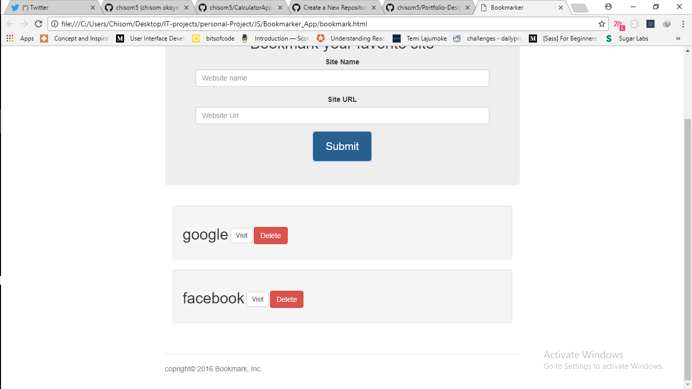

# Bookmarker app implemented with VanillaJs

This is a bookmarker application that accept, site name and url and place it in a grid below. 
below is a snapshot of the application 

## Features of this application

* You can edit the display bookmark site
* Delete already existing bookmark
* It made use of localstorage that save the bookmark site for it to display on reload.
